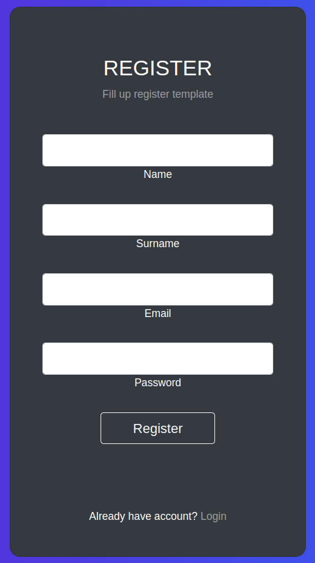
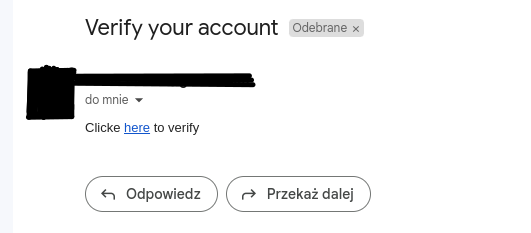
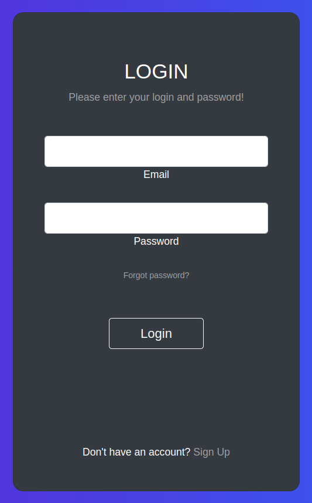

# Email verification app

## Application description

Sending verification email to new user.
Login is possible after verification.

- Framework: Django
- Authentication library: django-allauth
- Database: Postgres

### Requirements:

```
asgiref==3.7.2
certifi==2023.7.22
cffi==1.15.1
charset-normalizer==3.2.0
cryptography==41.0.3
defusedxml==0.7.1
Django==4.2.4
django-allauth==0.55.0
idna==3.4
oauthlib==3.2.2
psycopg2-binary==2.9.7
pycparser==2.21
PyJWT==2.8.0
python3-openid==3.2.0
requests==2.31.0
requests-oauthlib==1.3.1
sqlparse==0.4.4
typing_extensions==4.7.1
urllib3==2.0.4
```

## Instalation & configuration:

### Step 1: Install PostgresSQL locally.
```
sudo apt-get install postgresql 
```

### Step 2: Clone repository.
```
path/to/folder
git clone git@github.com:LaskiKa/Booking-conference-room-app.git
```
### Step 3: Create virtual enviroment & install requirements.txt
```
python -m venv venv
source venv/bin/activate
pip install -r requirements.txt
```

### Step 4: Setup database.
```
create database 'Database Name'

set postgresql database in settings.py or loccaly
DATABASES = {
    'default': {
        'HOST': '127.0.0.1',
        'NAME': 'booking_conf_rooms_db',
        'ENGINE': 'django.db.backends.postgresql',
        'USER': '',  
        'PASSWORD': '',
    }
}
```
**USER & PASSWORD depend on your PostgreSQL configuration**

### Step 5: Setup Email Backend in settings.py or locally.
Email_Host is set up for gmail configuration.

```
EMAIL_BACKEND = 'django.core.mail.backends.smtp.EmailBackend'
EMAIL_HOST = 'smtp.gmail.com'
EMAIL_PORT = 465
EMAIL_USE_SSL = True
EMAIL_ADDRESS: '', 
EMAIL_PASSWORD: ''
```

### Step 5: Run server.
```
python manage.py makemigrations
python manage.py migrate
python manage.py create superuser
python manage.py runserver localhost:8000
```
## Customer journey

1. As user, I'm registering to application http://127.0.0.1:8000/register/. To register I have to fill the labels and click register button.



2. A verification link is sent to the address provided during registration.


3. After verification I can login http://127.0.0.1:8000/login/.



